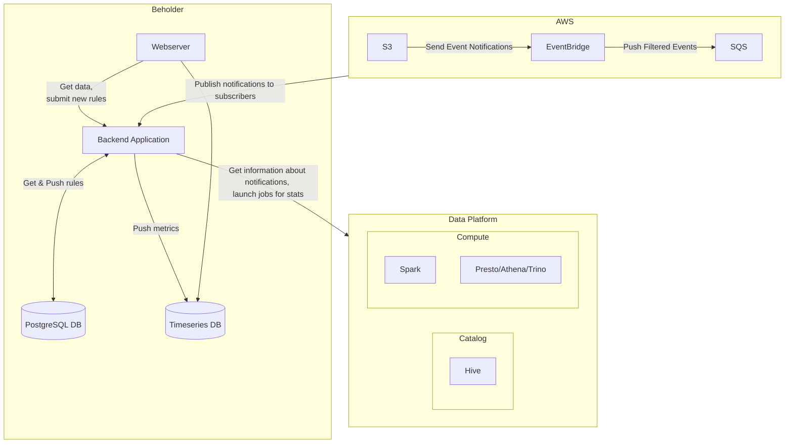
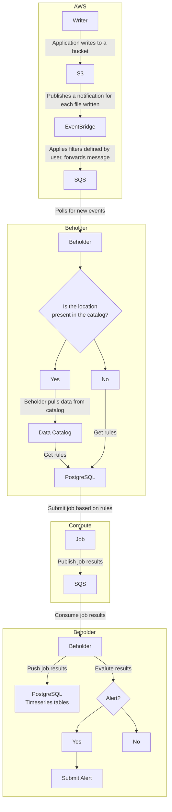

# Beholder
Beholder is an open source data observability solution. At the time of writing Beholder only supports AWS, Spark and Hive.

## Components
### Beholder
Beholder is the core application with both a front- and backend. The frontend is responsible for the display of data as
well as allowing users to define rules to be evaluated on datasets, whereas the backend is the center of communication 
between the various services.

#### Metrics
Beholder (will) calculate the following metrics for each event by default:
- Bytes written
- Rows written

In addition, there are extra metrics you can define:
- Aggregations by key
- Cardinality of column(s)
- Null count

#### Alerting
If an anomaly is detected Beholder can dispatch alerts in order to notify users and enable them to proactively investigate.

#### Terraform support
TBD

### PostgreSQL
Postgres is used to store both transactional and time series data .

### AWS
Beholder currently only supports AWS as cloud platform. It requires S3 object notifications to be setup in order to take
and event driven approach in calculating metrics. Without it, beholder can run on a time-based schedule. Though this is
not recommended. You can define filters to determine when you want Beholder to take action.

### Data Catalog
Beholder will leverage a data catalog to enrich the observed data. For instance, if the location of an event is not known
in the catalog it is able to dispatch an alert for this. If you only use schedule based observations, it will use the catalog
to know what to monitor

### Compute
Beholder itself does not compute the metrics, it will rely on other tools to do so, such as Spark or Presto.

## How it works
### Event driven
